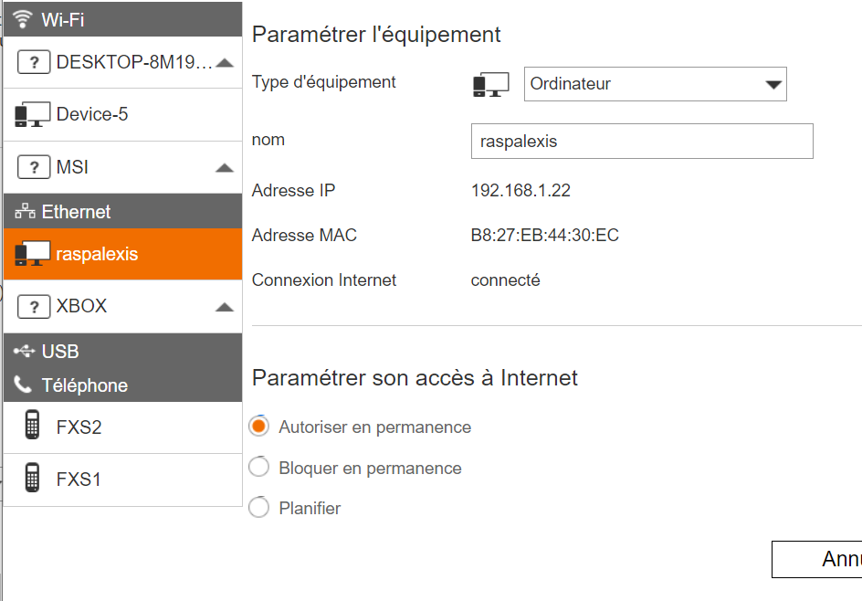
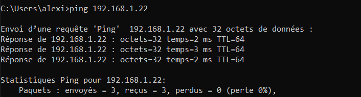
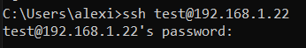
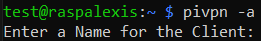
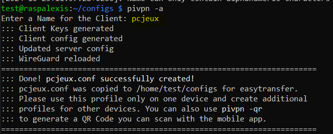
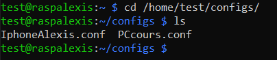
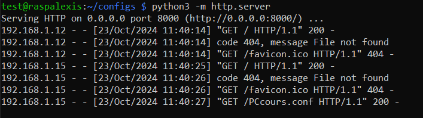
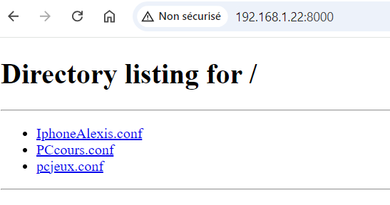
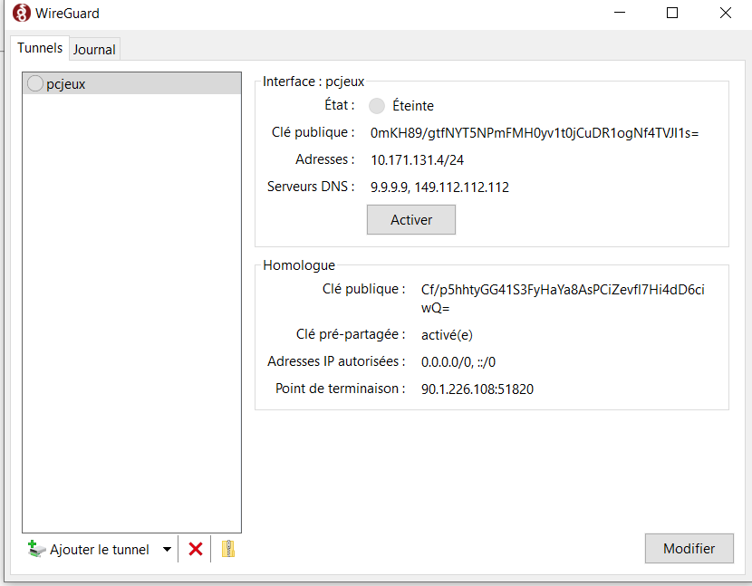
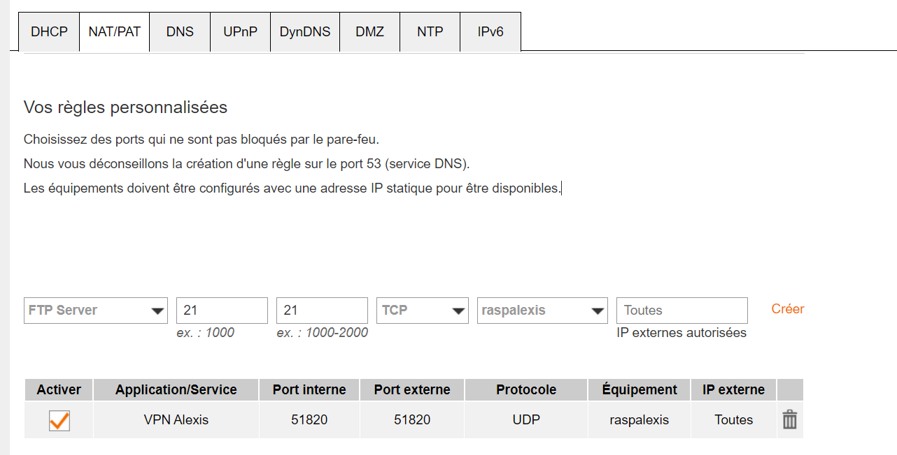

# Configuration pivpn sur un raspberry : 

### Connexion au rapsberry : 

#### Trouver la machine : 

Ouvrir l'interface de la box et récupérer l'adresse IP : 

#### Vérifier la communication : 

    ping <IP>

#### Connexion ssh 

    ssh <user>@<ip>

    

#### Mise à jour 

    sudo apt update && sudo apt upgrade 
    

#### Installation de pivpn 

    curl -L https://install.pivpn.io | bash

On ne touche pas au configuration.

#### Création d'un profile 

    pivpn -a  

Exemple : 

*Sélectionner le nom de l'utilisateur.*

La configuration se trouve dans /home/**utilisateur**/configs/

#### Partage du tunnel sur pour les utilisateurs :  

- Windows : 

Sur le raspberry, se placer dans le dossier /home/**utilisateur**/configs/ et créer un serveur python.

    cd /home/utilisateur/configs/
    python3 -m http.server

Accéder au serveur avec la machine qui souhaite se connecter :  

Récupérer le fichier de configuration associé à la machine que l'ont souhaite connecter.

Installer [wireguard](https://www.wireguard.com/install/)

Importer un nouveau tunel et séléctionner le fichier de configuration.

Pour lancer le VPN cliquer sur Activer.

- Téléphone : 
Installer Wireguard sur mobile.
Faire la commande 

    pivpn -qr **profile**

Cette commande affichera un qr code, il faut le scanner en cliquant importer un tunnel sur l'application mobile.

#### Ajout de la redirection de port 

Pour autoriser la connexion depuis une machine extérieure au réseau local il faut ajouter une redirection de port sur votre box.

Box orange :  

Nom de la règle : VPN Alexis  
Port interne : 51820 (port de base wireguard) 
Port externe : 51820 (port de base wireguard) 
Protocole    : UDP 
Séléctionner l'équipement cible (le rapsberrypi) 
*possibilité de mettre une adresse ip statique*
Autorisé toute les IP(s) externe étant donnée que notre VPN doit être accèssible depuis tous les réseaux (privé, public, 4g ...)
 

Une fois la redirection de port activée, lancer le vpn et tous fonctionne.
